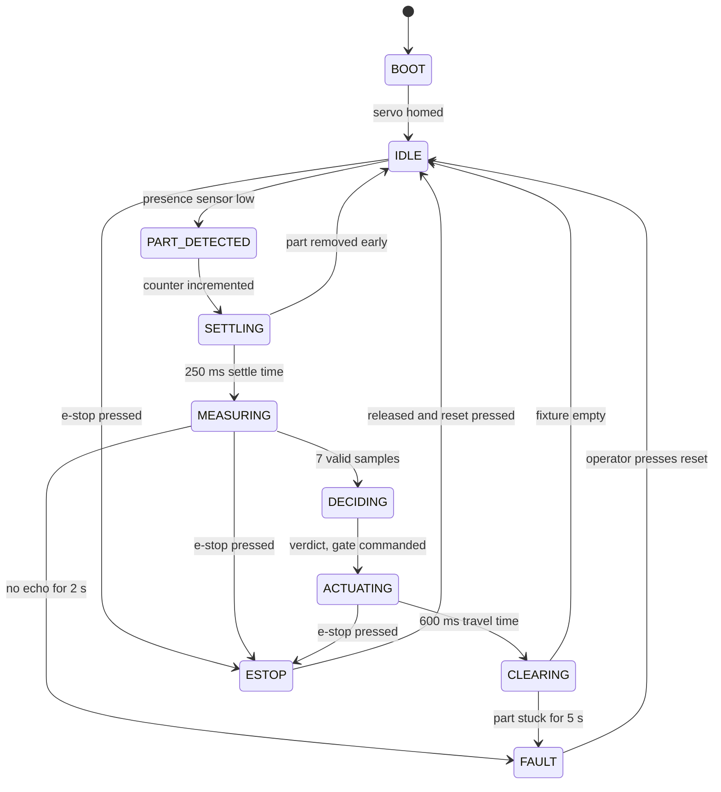
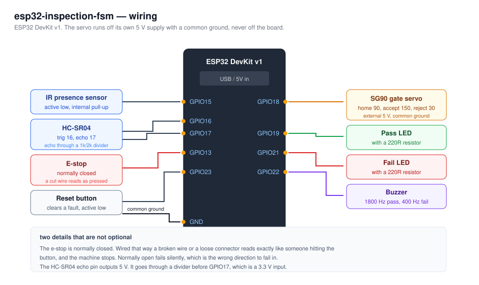

# ESP32 inspection station

[](https://github.com/Alex-2rios/esp32-inspection-fsm/actions/workflows/ci.yml)

A part inspection cell driven by an explicit finite state machine. A sensor detects a part, an
ultrasonic sensor measures its height, and a servo gate sends it down the accept or the reject
path. Nothing in `loop()` blocks, so the e-stop is honoured within one cycle no matter what the
machine is doing.

## The state machine



State by state notes, timings and the serial format are in [docs/states.md](docs/states.md).

## The firmware is testable without a board

The state machine lives in `lib/inspection/`, and it does not include a single Arduino header. It
takes an `Inputs` struct and returns an `Outputs` struct:

```cpp
Inputs in;
in.now_ms = millis();
in.part_present = digitalRead(PIN_PRESENCE) == LOW;
in.estop_active = digitalRead(PIN_ESTOP) == LOW;
in.reset_pressed = readResetButton(now);

Outputs out = machine.step(in);
applyOutputs(out);
```

`main.cpp` reads pins and writes pins. Everything that decides anything is in the library. That
split is what lets the whole thing run as a normal program on a laptop:

```bash
make test
```

```
23 test cases: 23 succeeded
```

Twenty three tests covering the median filter, the verdict boundaries, every timeout, the e-stop
behaviour and a three part production run, none of which need a servo, an ultrasonic sensor or a
board plugged in. They run in CI on every push, in about nine seconds.

The tests that matter most are the ones that are hard to check by hand:

- an e-stop pressed mid measurement stops the machine on that same cycle
- releasing the e-stop is not enough to restart, reset has to be pressed too
- a part is counted exactly once, even when the presence sensor stays high
- the CSV line is emitted exactly once per part
- readings that come back as NaN never enter the median

## Hardware



| Pin | Device | Notes |
|---|---|---|
| GPIO15 | IR presence sensor | active low, internal pull-up |
| GPIO16 / GPIO17 | HC-SR04 trigger / echo | echo through a divider if your module is 5 V |
| GPIO18 | SG90 servo, the accept/reject gate | external 5 V supply, common ground |
| GPIO19 / GPIO21 | pass and fail LEDs | |
| GPIO22 | buzzer | short high beep on pass, long low one on fail |
| GPIO23 | reset button | active low, internal pull-up |
| GPIO13 | e-stop | normally closed, so a cut wire reads as pressed |

The e-stop being normally closed matters. Wired that way, a broken wire or a loose connector
looks exactly like someone hitting the button, and the machine stops. Normally open would fail
silently, which is the wrong direction to fail in.

Everything is in `include/config.h`: pins, the target height, the tolerance and every timeout.
Retargeting the station to a different part means editing two numbers.

## Building

```bash
pio run -t upload
pio device monitor
```

You do not need the mechanical rig to see it work. Ground the presence pin to fake a part and
watch the transitions scroll past in the monitor.

CI builds the firmware and runs cppcheck on every push. The whole state machine, the servo
library and the serial logging fit in:

```
RAM:   [=         ]   6.6% (used 21788 bytes from 327680 bytes)
Flash: [==        ]  21.6% (used 283057 bytes from 1310720 bytes)
```

There is a lot of room left, which is the argument for keeping the logging verbose rather than
trimming it to save space that nothing else is asking for.

## What I learned

- Median instead of mean over the samples. Ultrasonic sensors throw the occasional wild reading
  when the echo bounces off something else, and one bad sample in seven is enough to flip a
  verdict when you average them. The median discards it for free.
- Two states I did not think I needed turned out to be the whole difference between a demo and
  something that runs unattended. `SETTLING` stops the sensor from reading a part that is still
  rocking. `CLEARING` stops one part from being counted twice, because `IDLE` fires on a level
  rather than an edge.
- Every state that waits on the physical world needs a timeout. The first version could sit in
  `MEASURING` forever if the sensor came loose, with the part on the fixture and no indication of
  why. Now it faults, lights the red LED and says which timeout fired.
- Recovery is deliberately manual. Both faults mean something physical needs a human, and an
  automatic retry would just jam the machine harder.
- Logging every transition with the time spent in the previous state made tuning the delays a
  measurement instead of a guess. `ACTUATING` was 1500 ms until the log showed the servo settling
  in well under 600 ms.
- Separating the decisions from the pins is what made this testable, and the tests immediately
  paid for themselves. Writing the e-stop tests is how I found that my first version let the
  machine resume the moment the button popped back out.
- Passing time in as `now_ms` instead of calling `millis()` inside the logic means a test can
  jump forward five seconds instantly. Timeouts that would take a minute to check by hand are
  covered in microseconds.

## Working on this

```bash
make help
```

The usual ones: `make build, make test, make upload, make monitor`.

Every push runs the CI workflow described above. A second workflow, `security.yml`, runs weekly
and on every push: it scans the history for committed secrets with gitleaks.

Dependabot opens pull requests for the GitHub Actions and the dependencies once a week.

Line endings are pinned to LF through `.gitattributes`, because half of this was written on
Windows and shell scripts with carriage returns fail on Linux in a way that is genuinely
confusing the first time.

## Next

Log the CSV to an SD card instead of the serial monitor, and add a second measurement axis so
the station checks width as well as height.
