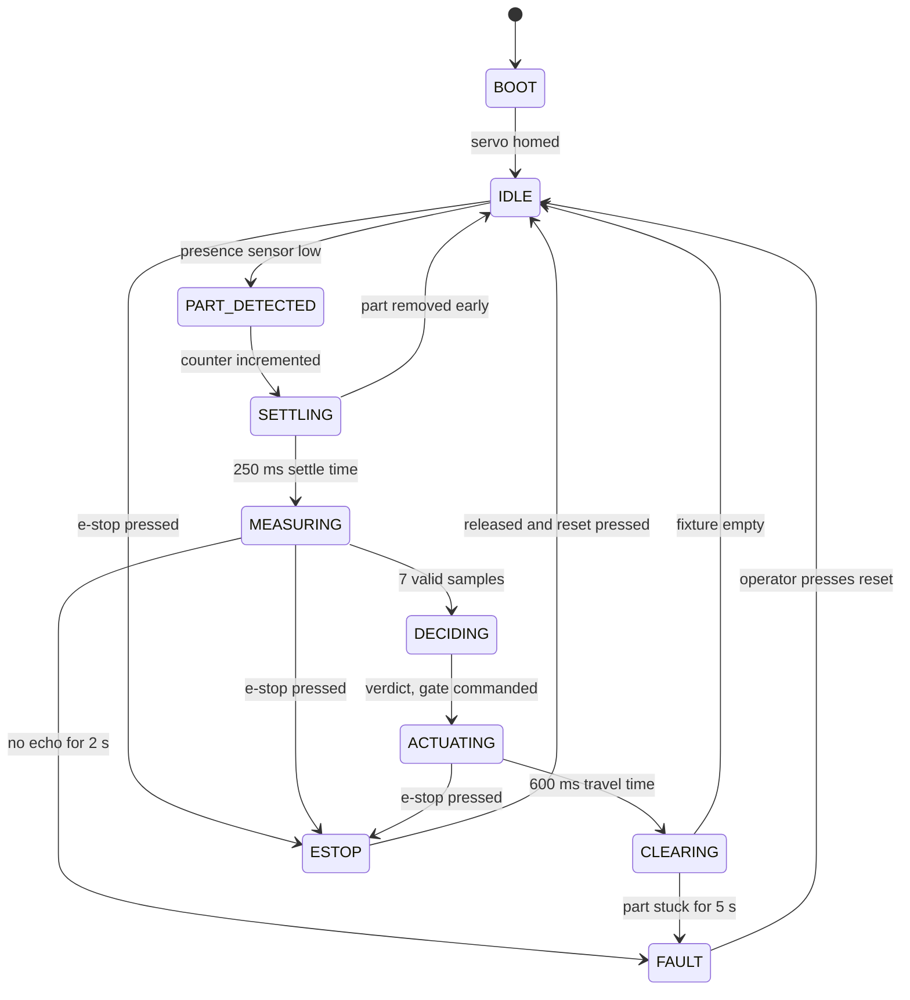

# ESP32 inspection station

A part inspection cell driven by an explicit finite state machine. A sensor detects a part, an
ultrasonic sensor measures its height, and a servo gate sends it down the accept or the reject
path. Nothing in `loop()` blocks, so the e-stop is honoured within one cycle no matter what the
machine is doing.

## The state machine



State by state notes, timings and the serial format are in [docs/states.md](docs/states.md).

## Hardware

| Pin | Device | Notes |
|---|---|---|
| GPIO15 | IR presence sensor | active low, internal pull-up |
| GPIO16 / GPIO17 | HC-SR04 trigger / echo | echo through a divider if your module is 5 V |
| GPIO18 | SG90 servo, the accept/reject gate | external 5 V supply, common ground |
| GPIO19 / GPIO21 | pass and fail LEDs | |
| GPIO22 | buzzer | short high beep on pass, long low one on fail |
| GPIO23 | reset button | active low, internal pull-up |
| GPIO13 | e-stop | normally closed, so a cut wire reads as pressed |

The e-stop being normally closed matters. Wired that way, a broken wire or a loose connector
looks exactly like someone hitting the button, and the machine stops. Normally open would fail
silently, which is the wrong direction to fail in.

Everything is in `include/config.h`: pins, the target height, the tolerance and every timeout.
Retargeting the station to a different part means editing two numbers.

## Building

```bash
pio run -t upload
pio device monitor
```

You do not need the mechanical rig to see it work. Ground the presence pin to fake a part and
watch the transitions scroll past in the monitor.

## What I learned

- Median instead of mean over the samples. Ultrasonic sensors throw the occasional wild reading
  when the echo bounces off something else, and one bad sample in seven is enough to flip a
  verdict when you average them. The median discards it for free.
- Two states I did not think I needed turned out to be the whole difference between a demo and
  something that runs unattended. `SETTLING` stops the sensor from reading a part that is still
  rocking. `CLEARING` stops one part from being counted twice, because `IDLE` fires on a level
  rather than an edge.
- Every state that waits on the physical world needs a timeout. The first version could sit in
  `MEASURING` forever if the sensor came loose, with the part on the fixture and no indication of
  why. Now it faults, lights the red LED and says which timeout fired.
- Recovery is deliberately manual. Both faults mean something physical needs a human, and an
  automatic retry would just jam the machine harder.
- Logging every transition with the time spent in the previous state made tuning the delays a
  measurement instead of a guess. `ACTUATING` was 1500 ms until the log showed the servo settling
  in well under 600 ms.

## Next

Log the CSV to an SD card instead of the serial monitor, and add a second measurement axis so
the station checks width as well as height.
